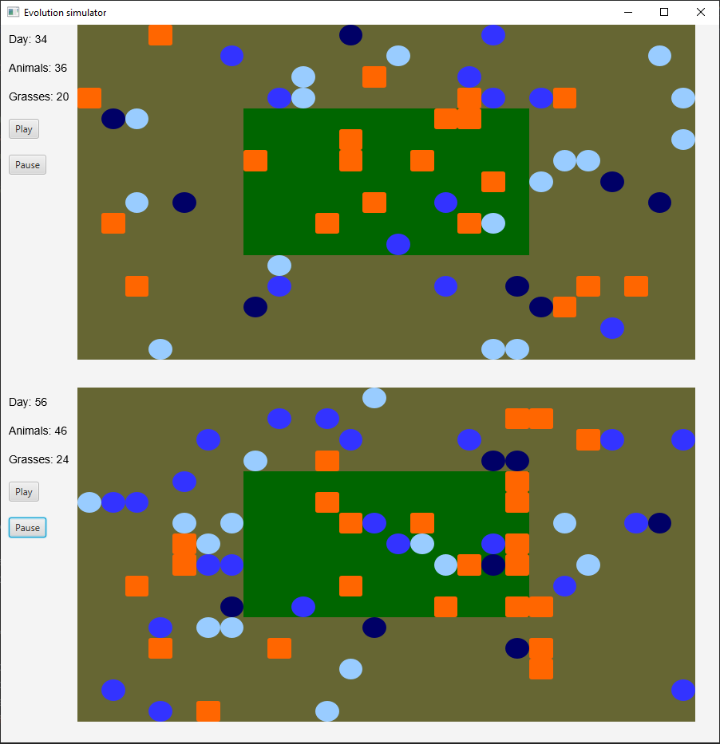

# Evolution Simulator

Project was created to practice object-oriented design in Java. 

### Use

Application simulates animals' evolution based on food access. 

Each move costs energy. Light blue circles represent exhausted animals, dark blue - strong animals. 
Food is shown as orange squares. Every time step one food grows up in jungle (green rectangle in the middle) and one on savanna (rest of the map).

Man can customize simulation by changing some initial variables in "EvolutionSimulator\parameters.json"

